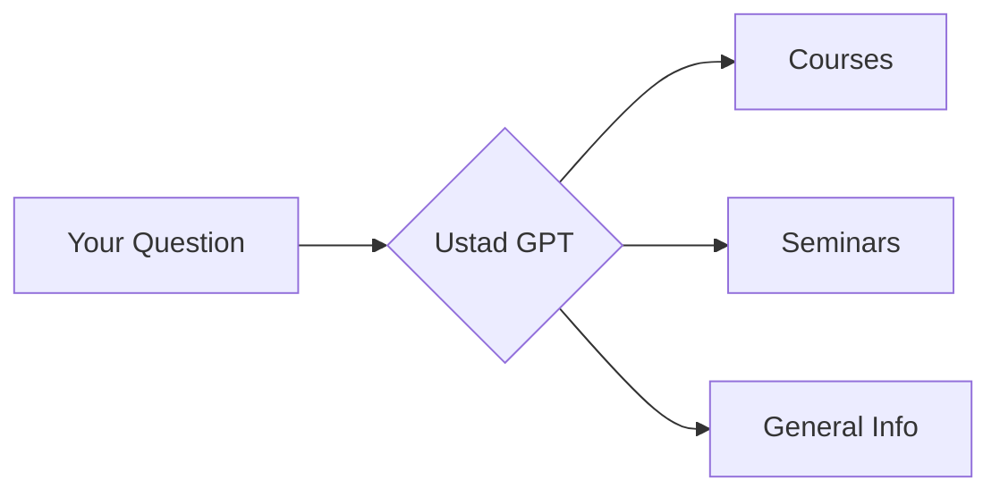

# Ustad GPT - Your AI Assistant for Ghumman Tech

## 🤖 What is Ustad GPT?
Ustad GPT is your intelligent assistant that provides instant answers about:
- **Courses** (current offerings, details, requirements)
- **Seminars** (upcoming events, schedules)
- **General questions** about Ghumman Tech's services

## 🔍 How to Use

### 1. Asking About Courses
**Try questions like:**
- "What beginner Python courses are available?"
- "Show me advanced courses under $200"
- "Which courses include certification?"

**You'll receive:**
✅ Course titles and descriptions  
✅ Pricing information  
✅ Skill level and format (live/self-paced)  

---

### 2. Finding Seminars  
**Example questions:**
- "When is the next AI workshop?"
- "List upcoming teacher training seminars"
- "What time is the Python webinar?"

**Response includes:**  
🗓️ Date and time  
💻 Location/format  
💰 Pricing (if applicable)  

---

### 3. General Questions  
**Ask about:**
- "How do I reset my password?"
- "What's your refund policy?"
- "Where can I download course materials?"

**Features:**  
📚 Answers from official documentation  
🔗 Helpful links when available  

## 🎯 Best Practices

### Do:
- Ask naturally like you're talking to a person
- Include keywords (e.g., "Python", "beginner", "live class")
- One question at a time for best results

### Avoid:
- "Search for courses" (be specific)
- Personal data requests (we protect your privacy)

## 🚀 Example Conversations

**User:**  
"What computer science courses are good for high school students?"

**Ustad GPT:**  
"We offer these K-12 courses:  
1. **Intro to Programming** (Beginner)  
   - Live sessions every Saturday  
   - $149 includes all materials  
2. **Web Design Basics**  
   - Self-paced with mentor support  
   - Currently 20% off at $119  

See full list at [Courses Page](#)"

---

**User:**  
"How do I submit an assignment after the deadline?"

**Ustad GPT:**  
"According to our policies:  
1. Late submissions lose 10% per day  
2. Max 3-day extension with instructor approval  
3. Submit via: Dashboard > My Courses > [Course Name] > Assignments  

[View full policy](#)"

## ❓ Need Help?
Contact admin@ghummantech.com if:
- Answers seem incorrect
- You get repeated errors
- Need human assistance