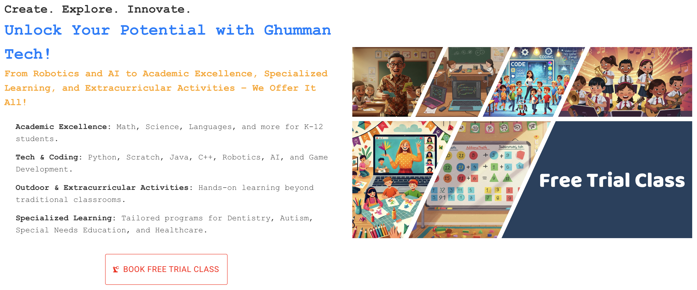
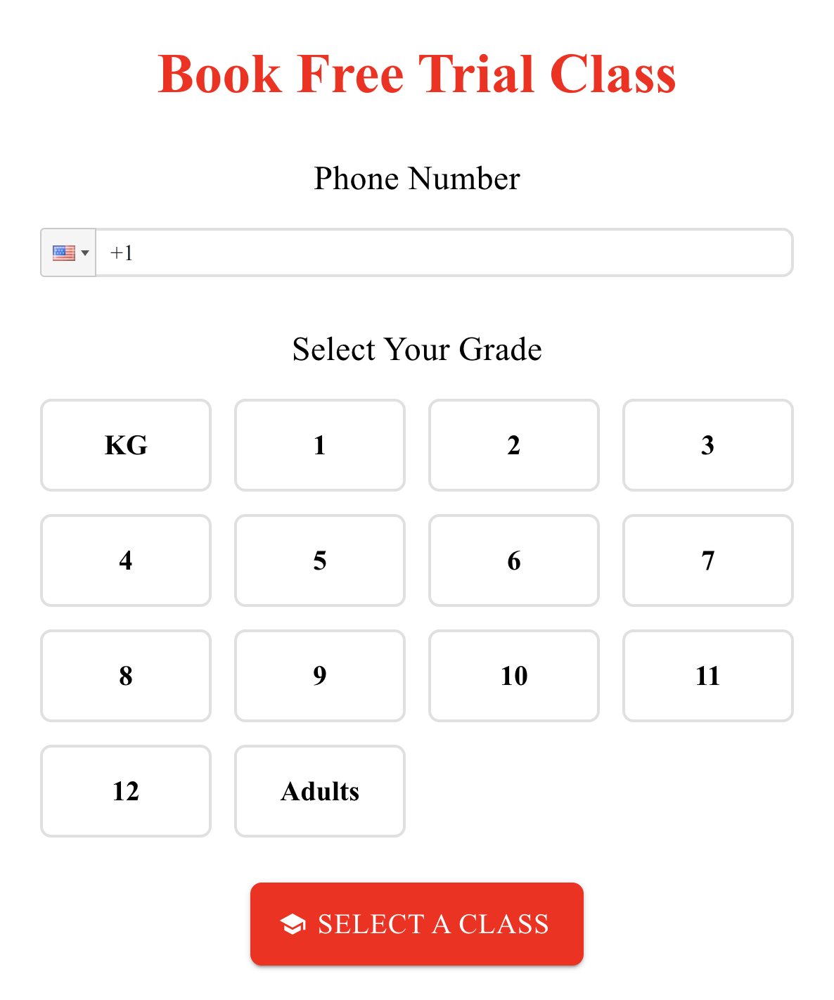
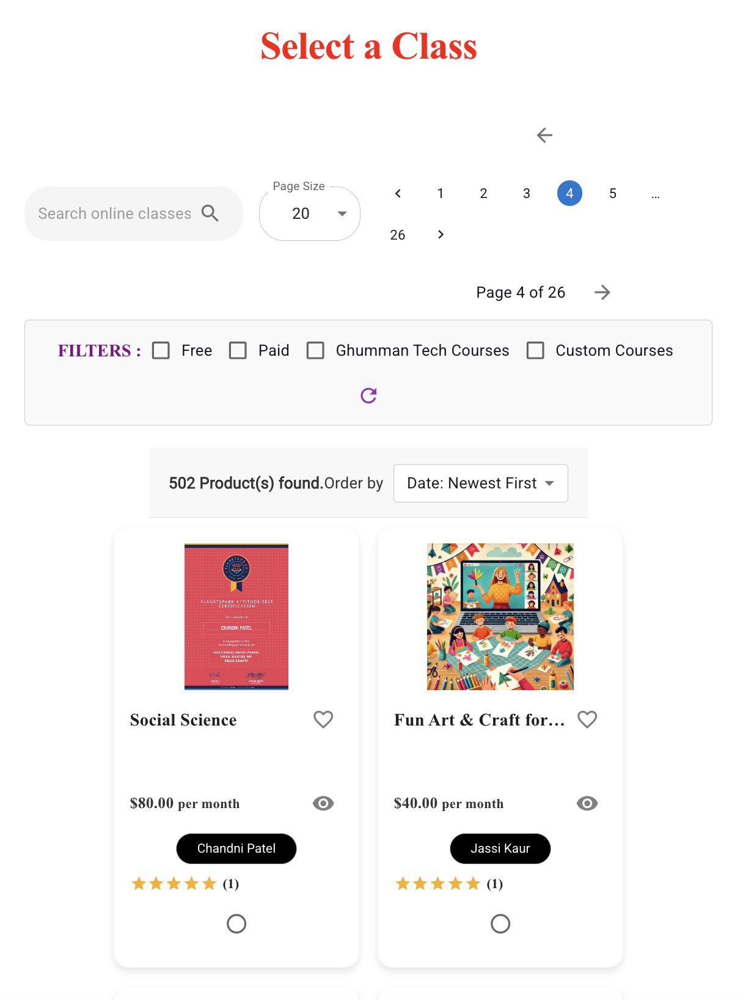
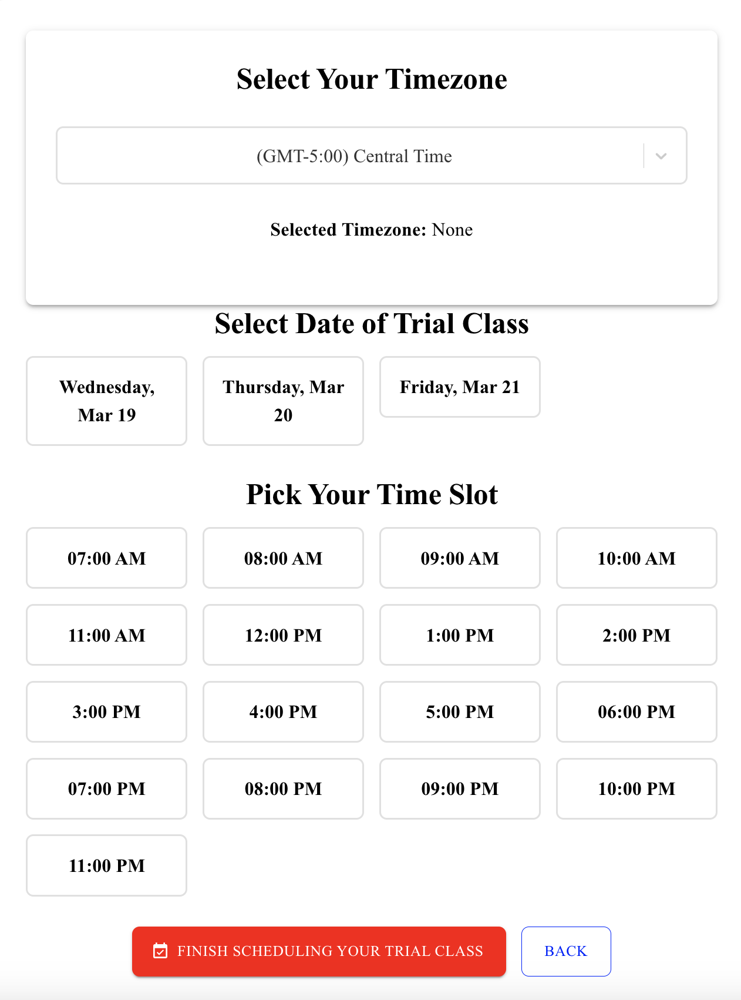
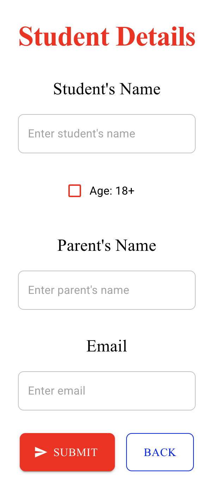

# How to Enroll in a Free Trial Class at Ghumman Tech

Welcome to Ghumman Tech! This step-by-step tutorial will guide you through the process of enrolling in a free trial class. Whether you're a student, parent, or an adult learner, this guide will make the enrollment process quick and easy.

---

## **Step 1: Visit the Ghumman Tech Website**
1. Open your web browser and go to [www.ghummantech.com/#free-trial-class](https://www.ghummantech.com/#free-trial-class).
2. Look for the **"Free Trial Class"** button on the homepage and click it.

---

## **Step 2: Select Your Grade or Learning Level**
1. On the enrollment page, you’ll see a dropdown menu or list of options to select your grade or learning level.
2. Choose the option that best describes your current level (e.g., Grade 5, Kindergarten, Adult Learner).

---

## **Step 3: Choose a Course**
1. Browse through the list of available courses. These include:
   - **Academic Subjects**: Math, Science, Languages, etc.
   - **Coding & Technology**: Python, Scratch, Robotics, AI, etc.
   - **Extracurricular Activities**: Sports, Arts, etc.
   - **Specialized Programs**: Dentistry, Autism Support, Healthcare, etc.
2. Click on the course you’re interested in.

---

## **Step 4: Pick a Date and Time Slot**
1. After selecting a course, you’ll see a calendar with available dates.
2. Choose a date that works for you.
3. Select a time slot from the available options.

---

## **Step 5: Enter Learner and Guardian Details**
1. Fill in the required details:
   - **Learner's Name**: Enter the name of the person attending the class.
   - **Guardian's Name**: If you're enrolling a child, enter your name as the guardian. If you're enrolling yourself, enter your name here.
   - **Email Address**: Provide a valid email address for confirmation and updates.
2. Double-check the information to ensure it’s accurate.

---

## **Step 6: Confirm Your Enrollment**
1. Review all the details you’ve entered (course, date, time, and personal information).
2. Click the **Submit** button to confirm your enrollment.

---

## **Step 7: Check Your Email**
1. After submitting, you’ll receive a confirmation email with the details of your trial class.
2. A reminder email will be sent a day before the class.
3. On the day of the class, you’ll receive a link to join the session.

---

## **Troubleshooting Tips**
- **Didn’t receive the confirmation email?** Check your spam folder or contact us at [admin@ghummantech.com](mailto:admin@ghummantech.com).
- **Need to reschedule?** Reply to the confirmation email or contact us to change your class date or time.

---

## **Contact Us**
If you have any questions or need assistance, feel free to reach out to us:
- **Email**: [admin@ghummantech.com](mailto:admin@ghummantech.com)

---

We’re excited to have you join us for a fun and enriching learning experience! Whether you're exploring academics, coding, extracurricular activities, or specialized programs, Ghumman Tech is here to help you grow. 🚀