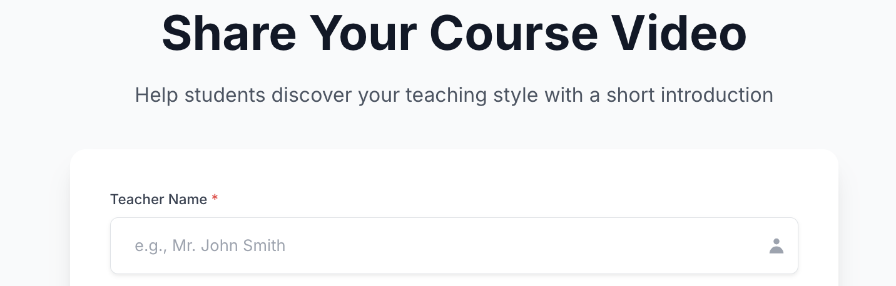
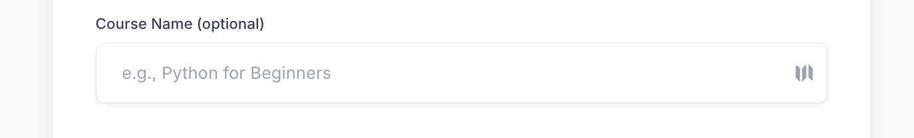
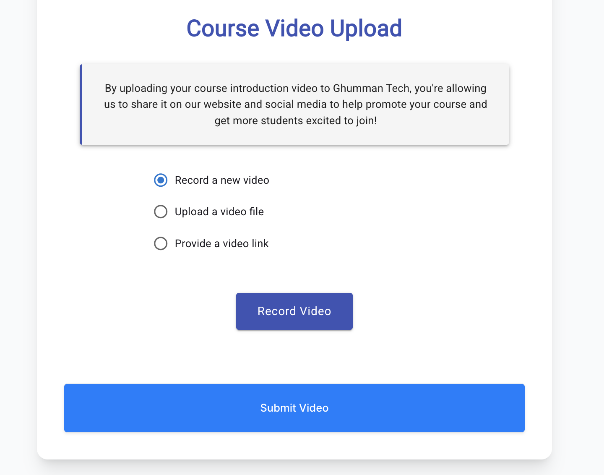

# How to Submit Your Course Video – A Step-by-Step Guide

This tutorial will walk you through how to use the **Request Teacher Course Video** form on Ghumman Tech to submit your promotional video.

We’ve made it easy and flexible for teachers to introduce their course by recording a short video, uploading one, or sharing a video link.

📩 **Submit your course video at:**  
👉 [https://www.ghummantech.com/RequestTeacherCourseVideo](https://www.ghummantech.com/RequestTeacherCourseVideo)

Follow these quick steps:

---

## 1. Enter Your Full Name

Start by entering your **full name** in the required field.

---

## 2. Provide Your Email Address

Next, fill in your **email address** so we can reach you.

---

## 3. (Optional) Enter Course Title

You may optionally specify the **name of your course**.

---

## 4. Choose How to Submit Your Video

You can submit your promotional video using **one** of the three options provided:

- 🎥 **Record in Browser** – Use your webcam to record a video (max 60 seconds)  
- 📁 **Upload from Your Device** – Upload a video file (max 100MB)  
- 🔗 **Paste a Video Link** – Share a link from YouTube, Vimeo, or Google Drive

After choosing one of these, click **Submit** to complete your entry.

---

That’s it! You’ll receive a confirmation after submission. If you run into any problems, please email us at **admin@ghummantech.com**.

Happy Teaching!
