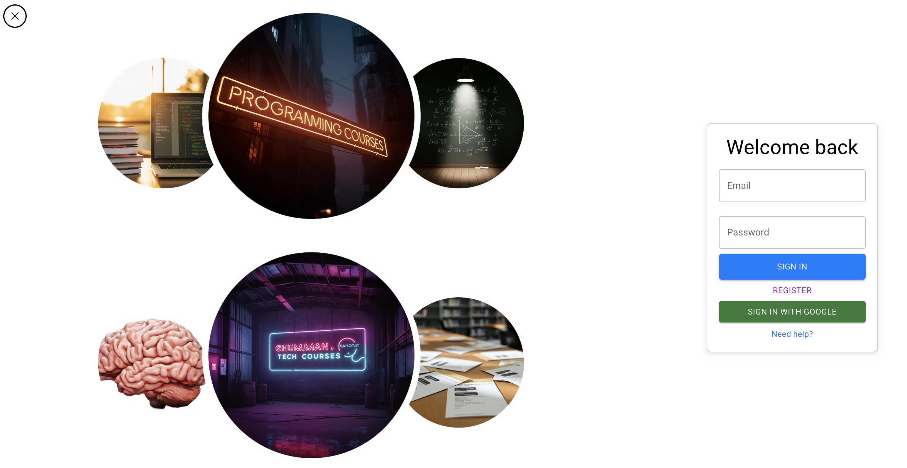
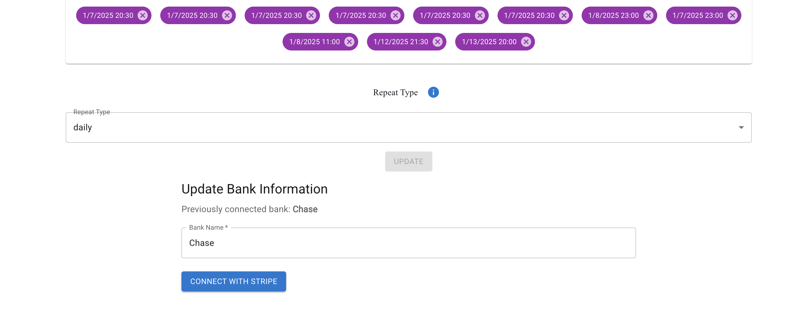
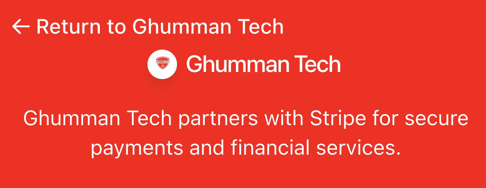
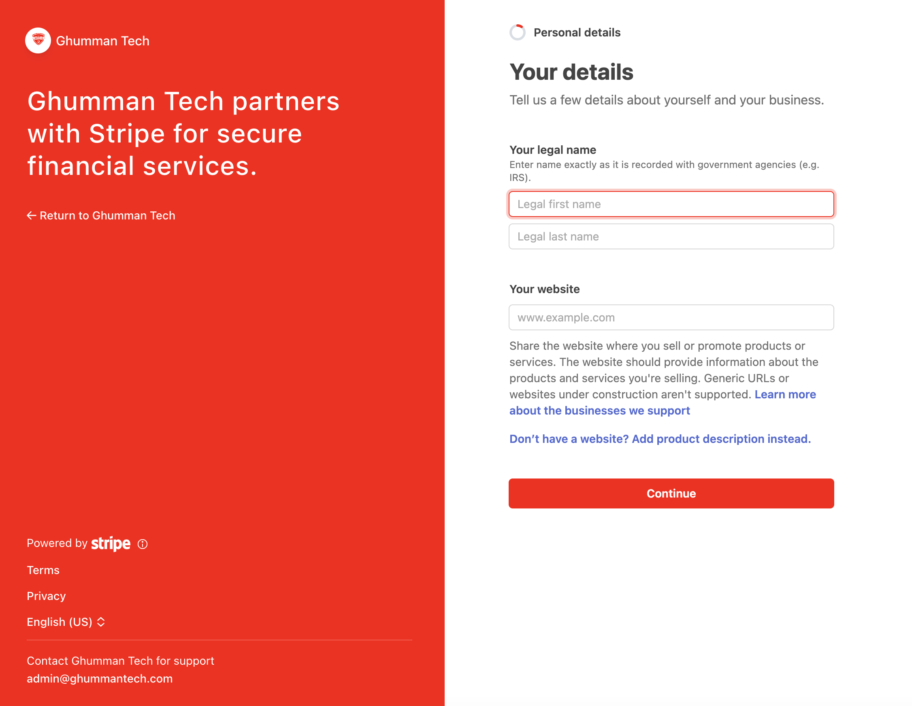
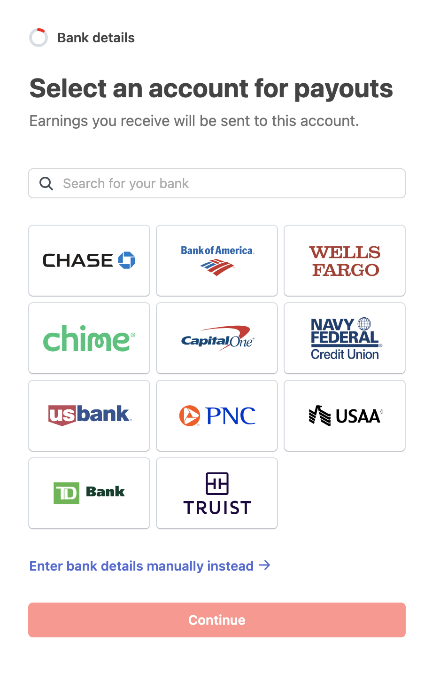

# Tutorial: Setting Up Bank Information on Ghumman Tech

Welcome to Ghumman Tech! This step-by-step tutorial will guide you through the process of setting up your bank information so you can start receiving payments for the courses you teach. By the end of this tutorial, you’ll have securely connected your bank account and be ready to earn.

---

## Table of Contents
1. [Introduction](#introduction)
2. [Step 1: Log in to Your Account](#step-1-log-in-to-your-account)
3. [Step 2: Navigate to the Teacher Profile Page](#step-2-navigate-to-the-teacher-profile-page)
4. [Step 3: Enter Your Bank Information](#step-3-enter-your-bank-information)
5. [Step 4: Connect with Stripe](#step-4-connect-with-stripe)
6. [Step 5: Complete the Process](#step-5-complete-the-process)
7. [Security and Privacy](#security-and-privacy)
8. [Payment Schedule](#payment-schedule)
9. [Troubleshooting](#troubleshooting)
10. [FAQs](#faqs)
11. [Video Tutorial](#video-tutorial)

---

## Introduction

As a teacher on Ghumman Tech, you can earn money by teaching courses. To receive payments, you need to connect your bank account securely. This tutorial will walk you through the process step by step.

---

## Step 1: Log in to Your Account

1. Visit [Ghumman Tech](https://www.ghummantech.com).
2. Click on **User Profile Icon** at the top right corner.
3. Enter your email and password to log in.

  

---

## Step 2: Navigate to the Teacher Profile Page

1. After logging in, click on your profile icon at the top right corner.
2. Select **Teacher Profile** from the dropdown menu.  
   Alternatively, you can directly visit:  
   [https://www.ghummantech.com/MyAccount/TeacherProfile](https://www.ghummantech.com/MyAccount/TeacherProfile).

  

---

## Step 3: Enter Your Bank Information

1. On the Teacher Profile page, scroll down to the **Bank Information** section.
2. Enter your **Bank Name** (e.g., "Example Bank").

  

---

## Step 4: Connect with Stripe

1. Click the **Connect with Stripe** button.
2. You will be redirected to Stripe’s secure onboarding page.
3. Follow the instructions on Stripe’s page to provide your bank account details.

  

---

## Step 5: Complete the Process

1. Once you’ve successfully connected your bank account, you will be redirected back to Ghumman Tech.
2. You will see a confirmation message indicating that your bank account is connected.

  

---

## Security and Privacy

Your security is our top priority. Here’s how we protect your bank information:

- **Stripe Integration**: We use Stripe, a globally trusted payment platform, to handle all bank connections and payments.
- **Encryption**: All sensitive information is encrypted and securely stored.
- **No Direct Access**: Ghumman Tech does not store or have access to your full bank account details.

---

## Payment Schedule

- **Monthly Payments**: Payments are processed at the end of each month.
- **Payment Calculation**: Your earnings are calculated based on the number of students enrolled in your courses and the revenue generated.
- **Payment Notification**: You will receive an email notification once your payment has been processed.

---

## Troubleshooting

### 1. **Stripe Onboarding Fails**
   - Ensure you have entered the correct bank details.
   - If the issue persists, contact Stripe support or reach out to Ghumman Tech support for assistance.

### 2. **Payment Not Received**
   - Verify that your bank account is correctly connected in your Teacher Profile.
   - Check your email for any notifications from Stripe or Ghumman Tech.
   - If the problem continues, contact Ghumman Tech support.

---

## FAQs

### 1. **Is it safe to connect my bank account?**
   - Yes, it is completely safe. We use Stripe, a globally trusted payment platform, to handle all bank connections securely.

### 2. **When will I receive my first payment?**
   - Payments are processed at the end of each month. You will receive your first payment after completing your first full month of teaching on Ghumman Tech.

### 3. **Can I change my bank account details later?**
   - Yes, you can update your bank account information at any time by visiting the **Teacher Profile** page.

### 4. **What happens if I don’t set up my bank account?**
   - You will not be able to receive payments for your courses until your bank account is connected.

### 5. **Who should I contact for help?**
   - For any issues related to payments or bank account setup, please contact Ghumman Tech support at [admin@ghummantech.com](mailto:admin@ghummantech.com).

---

<!-- ## Video Tutorial

For a visual walkthrough of the process, watch the video tutorial below:

<iframe
  src="https://www.tiktok.com/embed/7482874208444255518"
  style={{ width: '40%', height: '800px', border: 'none' }}
></iframe> 
---
-->

## Need Help?

If you have any questions or need assistance, feel free to reach out to our support team at [admin@ghummantech.com](mailto:admin@ghummantech.com). We’re here to help!

---

Thank you for being a part of Ghumman Tech. We look forward to supporting you in your teaching journey and helping you make a positive impact on students worldwide!