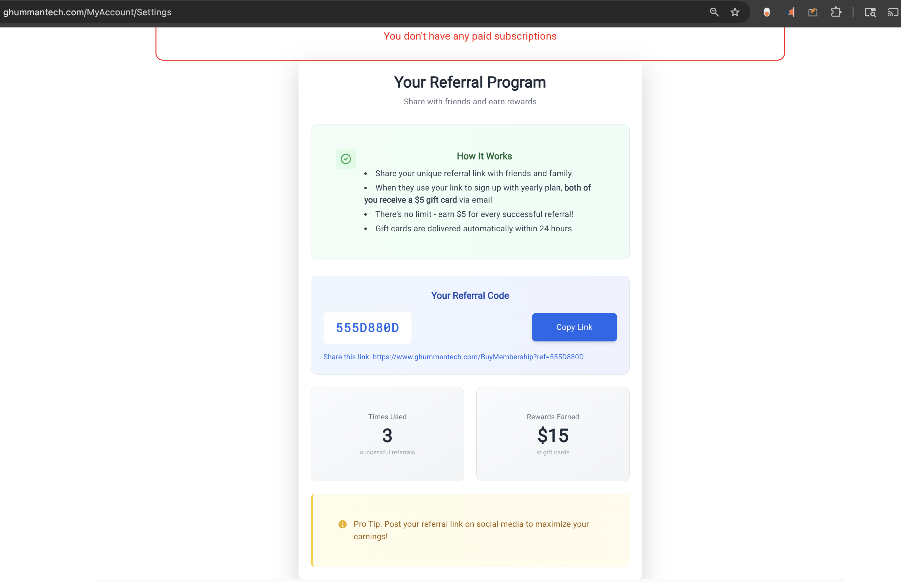
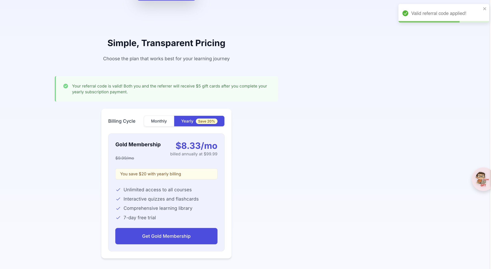

# 💸 How to Use the Ghumman Tech Membership Referral Program

Learn how to **generate**, **share**, and **redeem** referral codes to earn $5 gift cards when your friends and family purchase a Ghumman Tech yearly membership.

---

## ✅ Step 1: Go to Account Settings

To generate or customize your referral code:

1. Log in to your Ghumman Tech account.
2. Go to [My Account Settings](https://www.ghummantech.com/MyAccount/Settings).
3. Scroll to the **Referral Program** section.
4. You’ll see your **unique referral code** and a **referral link** like:

https://www.ghummantech.com/BuyMembership?ref=538Z871N

5. Copy your referral link and share it with friends, family, or on social media.

---

## 📢 Step 2: Share Your Referral Link

You can share your referral link:

- In group chats (WhatsApp, Messenger)
- On social media (Instagram, Facebook, X)
- In your email signature or blog

> There is **no limit** — share it as much as you like. You earn $5 for every friend who signs up for a **yearly membership** using your link.

---

## 🛒 Step 3: Referral Link Usage

When your friend clicks your referral link, they will be taken to the **Buy Membership** page.

For example:
https://www.ghummantech.com/BuyMembership?ref=538Z871N

If the referral code is valid:

- They’ll see a **notification** confirming that the referral code was applied.
- The message will inform them that a **$5 gift card** will be emailed after the 7-day trial.

---

## 🧾 Step 4: Purchase the Yearly Membership

- The referred user completes the sign-up and purchases the **yearly membership ($99/year)**.
- They pay the full $99 now.
- After their **7-day free trial** ends, both you and the new user will receive **$5 gift cards** via email.

> This referral benefit does **not apply** to monthly memberships.

---

## 🎁 Gift Card Delivery

- **Both users** (referrer and referred) receive a **$5 gift card**.
- Gift cards are emailed **after the 7-day trial period ends** and the account becomes active.
- There is **no cap** on how many gift cards you can earn.

---

## 🔁 Example

John creates his referral code and shares:

https://www.ghummantech.com/BuyMembership?ref=JohnRocks

Three of his friends sign up using the link and purchase a yearly membership. After their trials end:

- John receives **$15 in gift cards** ($5 for each referral).
- Each of his friends receives **their own $5 gift card** too.

---

## 🙋 FAQ

**Q: Can I use my code for monthly membership?**  
A: No. The referral program only applies to yearly memberships.

**Q: When are gift cards sent?**  
A: After the 7-day free trial period ends and the user becomes an active paid member.

**Q: Is the gift card sent automatically?**  
A: Yes, it will be emailed to both users after the trial period ends.

**Q: Can I change my referral code?**  
A: You can customize your code **once**. After that, it’s locked.

---

Start referring today and earn gift cards while helping others join the Ghumman Tech learning community! 🚀
