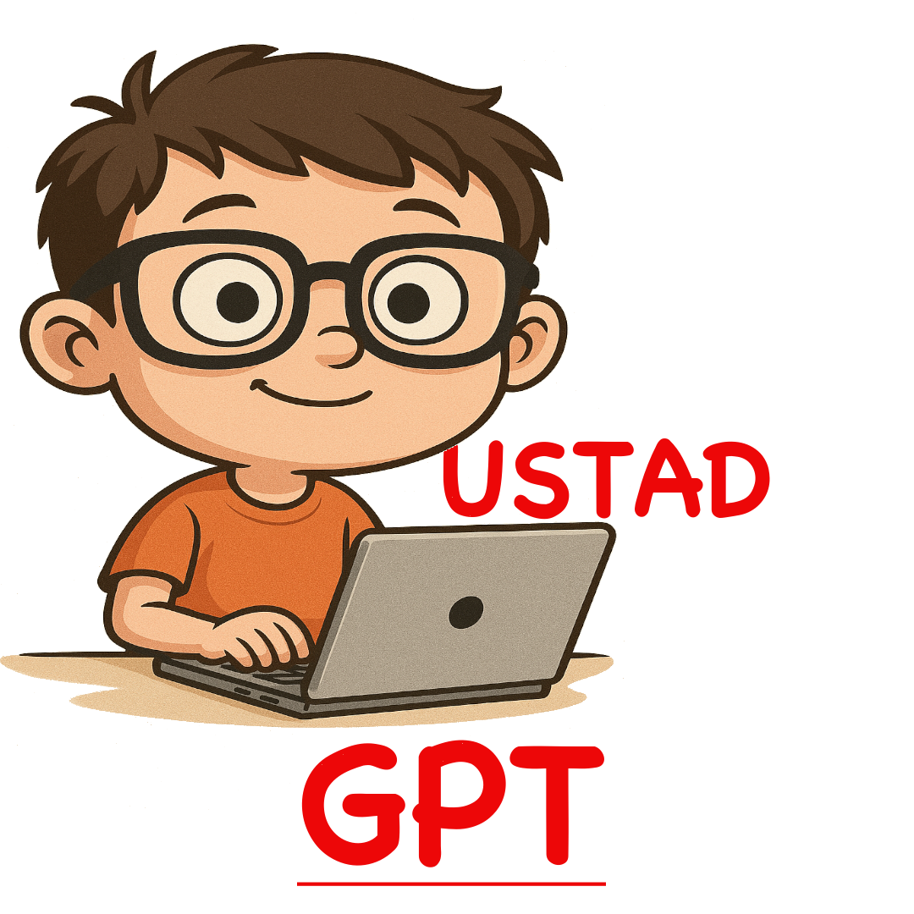

# Ustad GPT Tutorial: Your AI Assistant Guide

## 🎬 Getting Started with Ustad GPT

### Step 1: Accessing Ustad GPT
1. Log in to your Ghumman Tech account
2. Locate the Ustad GPT chat interface:
   - Web: Bottom-right corner of dashboard
   - Mobile: "Help" tab in main menu



### Step 2: Ask Your First Question
Type your question in natural language. Examples for beginners:
```plaintext
"What beginner courses are available?"
"Tell me about Python programming classes"
```

## 📚 Tutorial: Mastering Ustad GPT

### Lesson 1: Finding Courses
**Best practice workflow:**
1. Start with your interest area:
   ```plaintext
   "Show me data science courses"
   ```
2. Refine with filters:
   ```plaintext
   "Which data science courses are under $150?"
   ```
3. Get details:
   ```plaintext
   "What's included in the Advanced Python course?"
   ```

**Expected Response Format:**
```markdown
1. **Advanced Python** ($179)
   - 🕒 8-week program
   - 🏆 Includes certification
   - 📅 Next cohort: June 15
```

### Lesson 2: Exploring Seminars
**Interactive example:**
1. Ask about upcoming events:
   ```plaintext
   "What workshops are coming this month?"
   ```
2. Request specific details:
   ```plaintext
   "What will be covered in the AI seminar?"
   ```
3. Check availability:
   ```plaintext
   "Are there seats left for the teaching techniques workshop?"
   ```

**Pro Tip:**  
Use natural date references:
```plaintext
"What seminars are available next Tuesday afternoon?"
```

## 🛠️ Advanced Features

### Feature 1: Policy Lookups
**How to get official answers:**
1. Phrase as direct questions:
   ```plaintext
   "What's the late assignment policy?"
   ```
2. Request step-by-step guidance:
   ```plaintext
   "How do I request a course refund?"
   ```

### Feature 2: Course Comparisons
```plaintext
"Compare the beginner and advanced Python courses"
```

**Sample Output:**
```markdown
| Feature       | Beginner Python | Advanced Python |
|--------------|----------------|----------------|
| Duration     | 6 weeks        | 8 weeks        |
| Prerequisites| None           | Beginner course|
| Project      | 1 mini-project | 3 real-world projects |
```


## 🏆 Practice Exercises
1. Find a course matching:
   - Budget: $100-$200
   - Format: Self-paced
   - Topic: Web development

2. Locate:
   - The earliest available seminar
   - With price under $50

3. Ask about:
   - Course material download instructions
   - Certificate requirements

## 📞 Support
For unresolved issues:
email: admin@ghummantech.com

---

**Next Steps:**  
Try asking Ustad GPT right now! ▶️
```